#Interactive Data Visualisation

This repo is work based on "Interactive Data Visualisation for the Web" by Scott Murray

[D3 API Reference](https://github.com/d3/d3/blob/master/API.md)

## 05_data

* Adds elements to the DOM
* Dynamically alters properties based on bound data

## 06_Drawing-with-data

* Uses data to draw a Bar Chart with SVG

* Uses data to draw a Scattershot Chart with SVG

## 07_Scales

* Refines the Scattershot Chart with use of Scales

## 08_Axes

* Refines the Scattershot Chart with use of Axes in place of labels

## 09_Updates-transitions-motion

* Refines the original Bar Chart to use Scales

* Adds random updateable values to the Barchart

* Re-introduces the Scatterplot chart and adds random updateable values

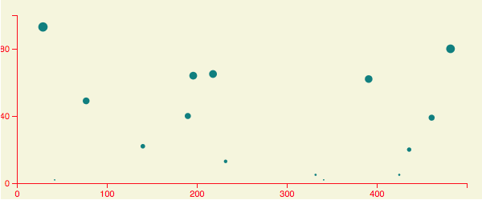

* Re-introduces the Bar chart and dynamically adds new values

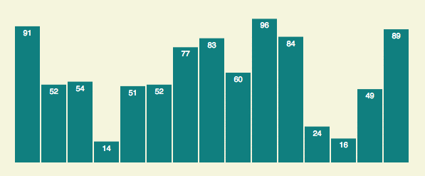

* Dynamically removes values from the Bar chart

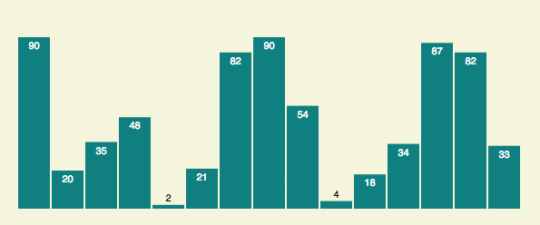

## 10_Interaction

* Adds transitions on hover event

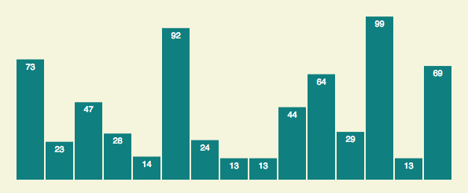

* Adds Sort event

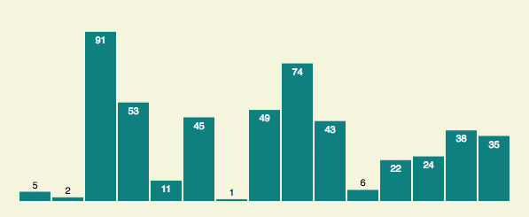

* Adds tooltips

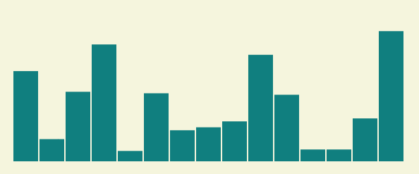

## 11_Using-paths

* Represents date/value data pairs with single line

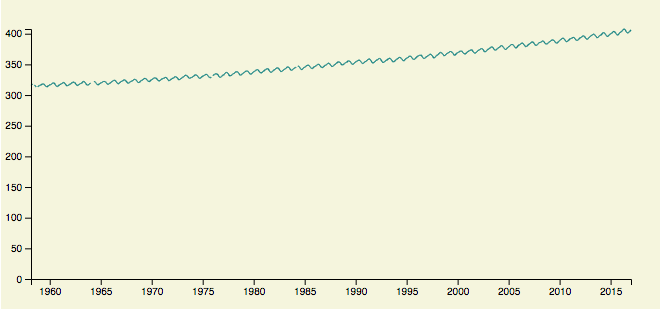

* Refines visualisation with reference line/label

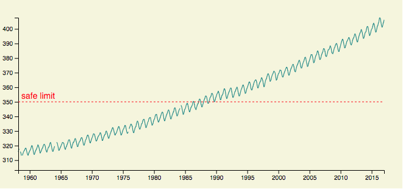

* Updates visualisation with area

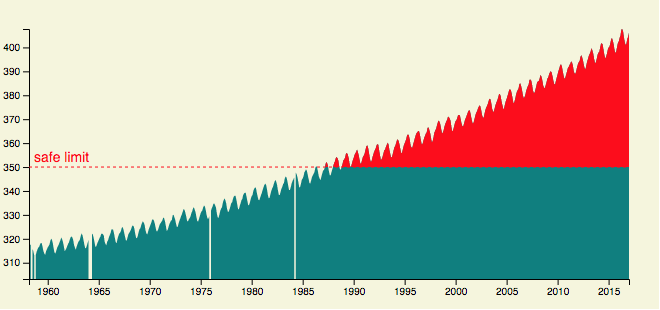

## 13_Layouts

* Draws pie chart

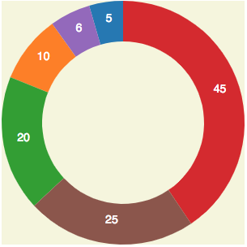

* Draws stacked bars

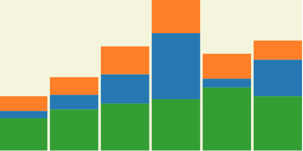

* Draws force layout

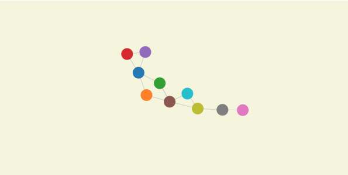

## 14_Geomapping

* Draws basic map

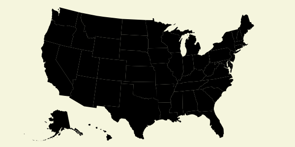

* Adds agricultural data as choropleth

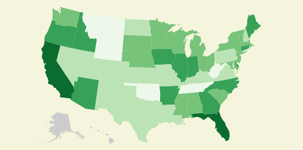

* Adds city population data as points

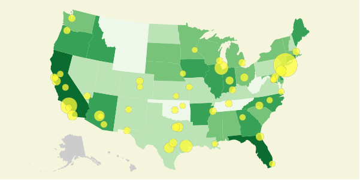
