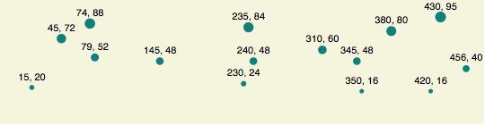

#Interactive Data Visualisation

This repo is work based on "Interactive Data Visualisation for the Web" by Scott Murray

[D3 API Reference](https://github.com/d3/d3/blob/master/API.md)

## 05_data

* Adds elements to the DOM
* Dynamically alters properties based on bound data

## 06_Drawing-with-data

* Uses data to draw a Bar Chart with SVG

* Uses data to draw a Scattershot Chart with SVG

## 07_Scales

* Refines the Scattershot Chart with use of Scales

## 08_Axes

* Refines the Scattershot Chart with use of Axes in place of labels

## 09_Updates-transitions-motion

* Refines the original Bar Chart to use Scales

* Updates values to a new dataset
* Adds transitions to the udpate

* Renders and updates chart with random values
